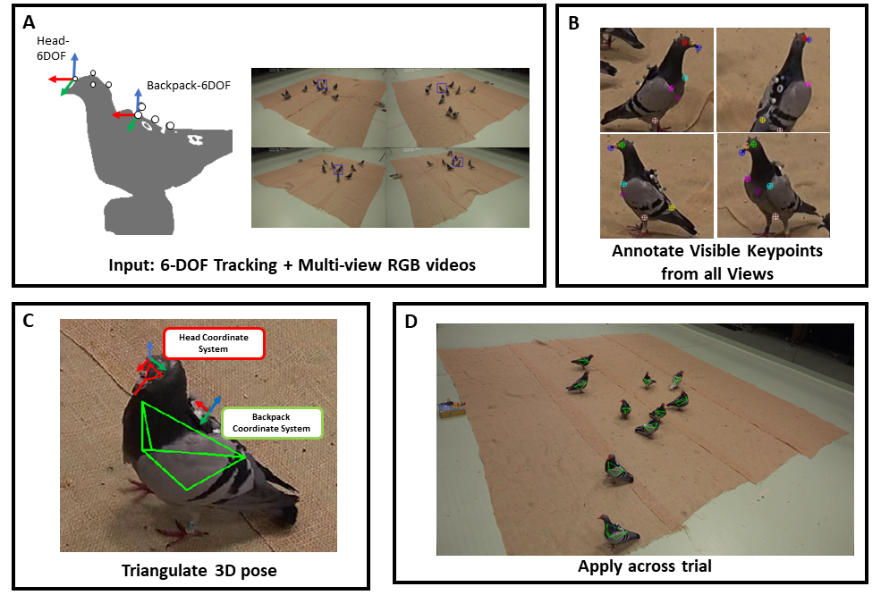
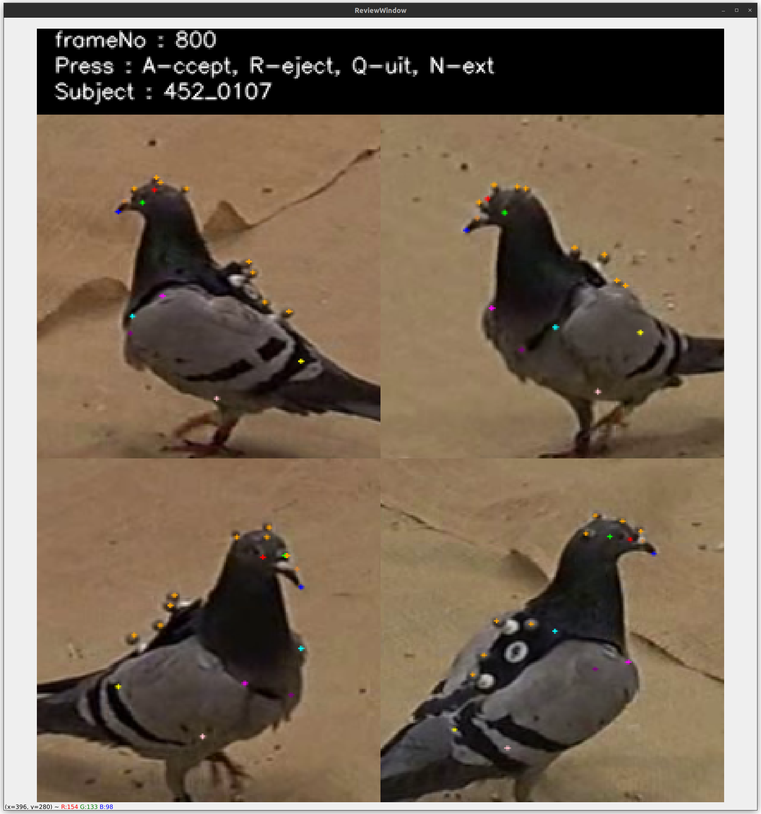

# 3DPOP-Annotation Pipeline (3DPOP-AP)
Welcome to the 3DPOP Annotation pipeline directory, here we provide a toolkit to customize your own keypoints in the 3DPOP Dataset. 

Please refer to the original manuscript for the annotation principle. In short, we measured accurate motion capture data on 8 markers attached on pigeons, 4 on the head and 4 on the backpack. This lets us compute the 6-DOF pose of both objects at each frame. The 3DPOP annotation pipeline then aims to determine the relative position of keypoints that are rigid relative to these attached markers, then use the 6-DOF pose of each object to propogate the keypoints accross the trial. 

## Summary
Please refer to this [script](./ApplicationExamples/Run3DPOPAP.py) for an example for running the whole pipeline. This is the general workflow of the 3DPOP_AP:
1. **Choose Frames:** Within a trial, choose which frames to annotate
2. **Annotation:** Annotate the defined keypoints for the chosen frames (recommended 5-10 frames)
3. **Create Triangulated Features:** From 2D annotations, triangulate the 3D positions of each keypoint for each frame, then calculates the coordinates of the keypoint in the object coordinate space
4. **Generate Annotations**: Propagate the definitions accross the whole trial, then generates annotation files for 3D, 2D and bounding boxes.

### 1. Choose frames:
The first step is to choose frames to annotate. You will be provided by a screen image from all 4 views. You can choose which frames to save.

**Controls:**

h: Print help in terminal

\+ : Increase step size 

\- : Increase step size 
 
n : Next frame 
 
b : Previous frame 
 
s : Enter frame status in log file 

q : Quit

### 2. Annotation:
Next, you can then annotate the chosen keypoints on the frames you chosen. You can use [customFeatures.txt](./customFeatures.txt) to specify your own keypoints, making sure that the name of each point starts with the object rigid body it belongs to (hd: head, bp: backpack).

The annotation interface provides an arbitiary bounding box around the subject of interest, and a zoomed in bounding box window.

**Controls:**

Left Click: Annotate keypoint

Right Click: Erase keypoint

w-s-a-d : Move one pixel in relative direction

h : Print help in terminal

q : Quit

b : Back

r : Reset annotations

n : Next frame

1-9: Cycle through keypoints

### 3. Triangulate Features:
After annotation, the 2D annotations from multiple views will now be used to triangulate an estimated 3D coordinate. You will then be provided with a screen to accept or reject annotations for each given frame. The 3D coordinate of keypoints of accepted frames will then be averaged to obtain the final object definition. If you already have object definitions for the specific bird ID (from annotating another sequence), you can also use that definition by typing "Y" when prompted.

### 4. Generate Annotations:
Finally, annotations for 2D, 3D and bounding boxes will be generated into csvs into the annotation directory.

## Contact:
If you have any questions or issues, please contact Alex Chan:
Email: hoi-hang.chan [at] uni-konstanz.de
