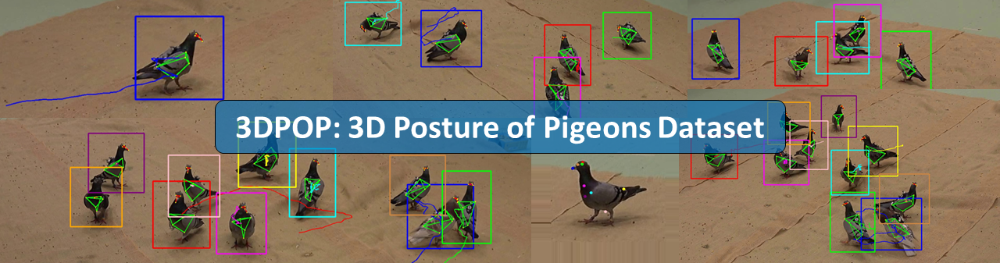

# 3DPOP: 3D Posture of Pigeons Dataset


This is the repository for the publication: 3D-POP - An automated annotation approach to facilitate markerless 2D-3D tracking of freely moving birds with marker-based motion capture

**Hemal Naik\***, **Alex Hoi Hang Chan\***, Junran Yang, Mathilde Delacoux, Iain D Couzin, Fumihiro Kano, Mate Nagy

Centre for the Advanced Study of Collective Behaviour, Universtiy of Konstanz, Germany

## Dataset
The 3DPOP dataset is a large scale 2D to 3D posture, identity and trajectory dataset for freely moving pigeons. We use marker-based motion tracking to first track precise head and body position and orientation for multiple individuals, then propagated custom keypoints based on the relative positions of markers and keypoints. 

## Dataset and 3D POP Reader
This repository includes the 3DPOP reader class, for reading the dataset. Click [here](./Examples/Dataset_Example.ipynb) for an example of the functions provided with the dataset reader. For better customization options for the user, we also provide a detailed breakdown of the dataset structure [here](./Examples/Dataset%20Structure.ipynb).

To get started, download the dataset [here](https://edmond.mpdl.mpg.de/dataset.xhtml?persistentId=doi:10.17617/3.HPBBC7) and paste it into the 'Dataset' directory, or a directory of your choice. 

To install all required dependencies, first [install anaconda] (https://docs.anaconda.com/anaconda/install/index.html) then create an environment:

```
conda env create --file=environment.yml
```

## 3DPOP-AP: 3D POP Annotation Pipeline
We also provide an implementation of 3DPOP-AP, our annotation pipeline to generate custom keypoints for the dataset. Please refer to the [README](./POP3D_AP/README.md) for more information


## Abstract
Recent advances in machine learning and computer vision are revolutionizing the field of animal behavior by enabling researchers to track the poses and locations of freely moving animals without any marker attachment. However, large datasets of annotated images of animals for markerless pose tracking, especially high-resolution images taken from multiple angles with accurate 3D annotations, are still scant. Here, we propose a method that uses a motion capture (mo-cap) system to obtain large amount of annotated data on animal movement and posture (2D and 3D) in a semi-automatic manner. Our method is novel in that it extracts the 3D positions of morphological keypoints (e.g eyes, beak, tail) in reference to the positions of marker attached to the animals. Using this method, we obtained, and offer here, a new dataset - 3D-POP with approximately 300k annotated frames (4 million instances) in the form of videos having groups of one to ten freely moving birds from 4 different camera views in a 3.6m x 4.2m area. 3D-POP is the first dataset of flocking birds with accurate keypoint annotations in 2D and 3D along with bounding box and individual identities, and will facilitate the development of solutions for problem of 2D to 3D markerless pose, trajectory tracking and identification in birds.

## 3D-POP Dataset
The 3D-POP (3D Posture of Pigeons) dataset is a large scale dataset that provides ground truth data on individual identies and trajectories, bounding box, 2D and 3D keypoints for 1,2,5,10 individuals. The dataset was collected in a large scale maker-based motion tracking facility, with 4 camera views in 4K resolution.Keypoints were generated by computing the relative position of motion tracked markers to keypoints, then propagated throughout each sequence.


https://user-images.githubusercontent.com/57260510/223777471-2289b18d-15eb-4a82-bb7d-7140192a0d1a.mp4


Refer to publication for more details....
# Citation
@InProceedings{Naik_2023_CVPR,
    author    = {Naik, Hemal and Chan, Alex Hoi Hang and Yang, Junran and Delacoux, Mathilde and Couzin, Iain D. and Kano, Fumihiro and Nagy, M\'at\'e},
    title     = {3D-POP - An Automated Annotation Approach to Facilitate Markerless 2D-3D Tracking of Freely Moving Birds With Marker-Based Motion Capture},
    booktitle = {Proceedings of the IEEE/CVF Conference on Computer Vision and Pattern Recognition (CVPR)},
    month     = {June},
    year      = {2023},
    pages     = {21274-21284}
}


# Acknowledgements
Funded by the Deutsche Forschungsgemeinschaft (DFG, German Research Foundation) under Germany’s Excellence Strategy – EXC 2117 – 422037984

## Contact:
Alex Chan Hoi Hang

hoi-hang.chan [at] uni-konstanz.de

Centre for the Advanced Study of Collective Behaviour, University of Konstanz
